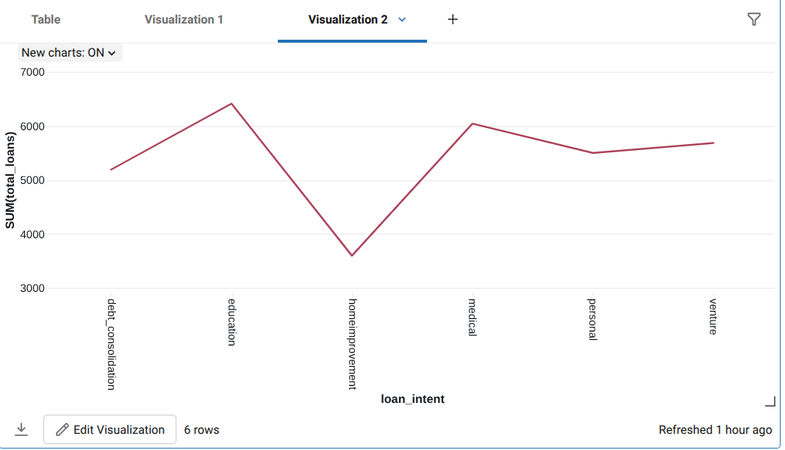
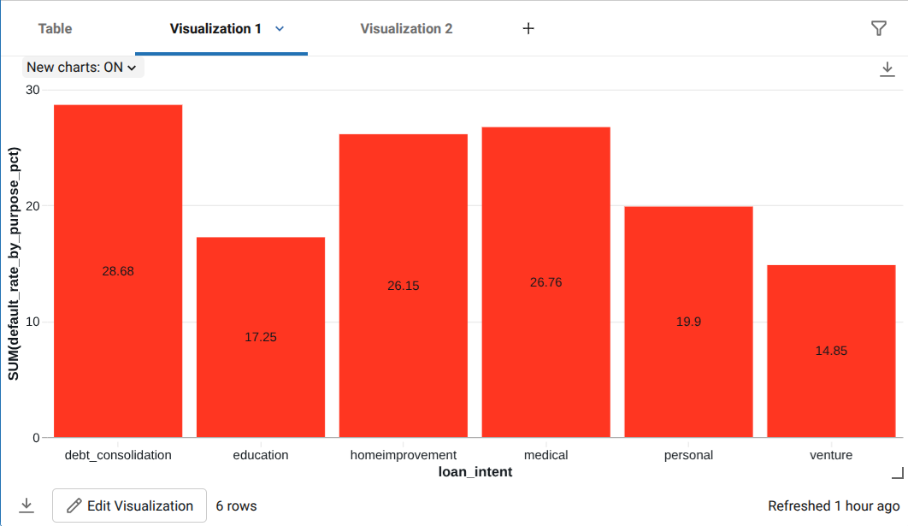
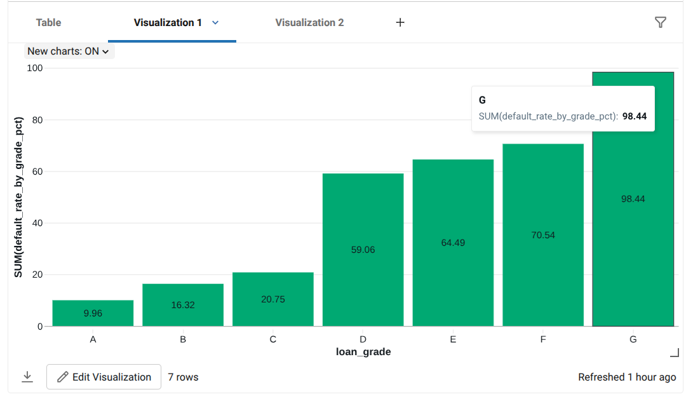
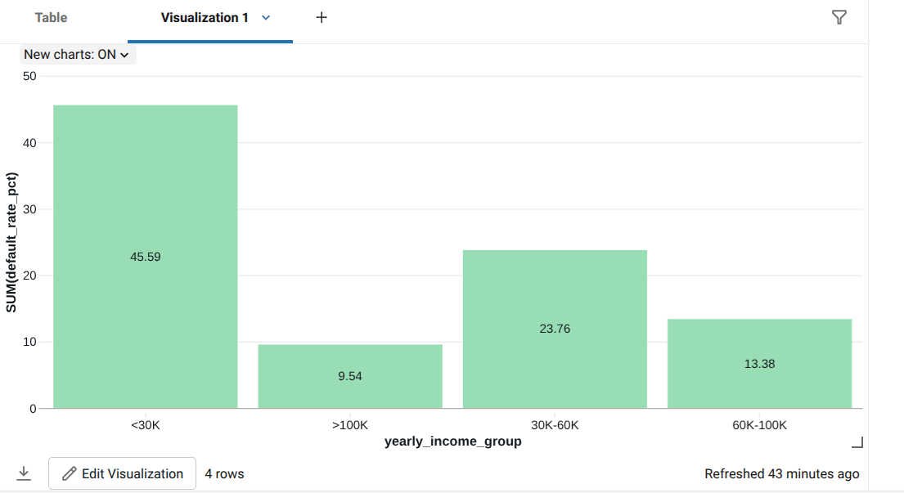

# Credit risk assesment ETL Pipeline with Databricks & PySpark

This project implements an end-to-end ETL pipeline using Databricks and PySpark, strictly following the Medallion Architecture (Bronze, Silver, Gold).

The pipeline ingests the Credit Risk dataset, cleans and transforms the data, stores it as Delta tables, and produces analytical datasets to answer business questions (portfolio analysis, study of high risk clients, computing the KPIs to name a few).

## Architecture of the ETL pipeline
Credit Risk CSV (portfolio)
      │
      ▼
Bronze Layer
(raw data ingestion)
      │
      ▼
Silver Layer
(cleaning & standardization)
      │
      ▼
Gold Layer
(analytics)

## Technologies

- Databricks Free Edition
- Apache Spark (PySpark)
- Delta Tables
- Unity Catalog
- Python

## Dataset

Credit risk Dataset available on Kaggle at [this link](https://www.kaggle.com/datasets/laotse/credit-risk-dataset#).

The dataset contains information about borrowers from a bank including:

- age
- income
- purpose of the loan
- amount of the loan
- loan interest rate
- defaulted (Y/N)

## Bronze Layer

The raw CSV dataset is uploaded into a Unity Catalog Volume and ingested into Databricks. Main tasks:

- read CSV
- infer schema
- store raw data as a Delta table

## Silver Layer

The Silver layer prepares the data for analysis. Transformations include:

- removing duplicate records
- renaming columns for cleanness purposes
- trimming whitespace
- standardizing strings

## Gold Layer

The Gold layer creates analytical tables answering questions such as:

- Compute the KPIs (total n. of loans, total amount loaned, average interest rate, default rate, average borrower income);
- Metrics analysis of two groups: clients who defaulted and clients who didn't. Metrics computed include: average age, average income, average interest rate, average amount of the loans.
- Default rate per loan purpose?
- Default rate per age group? Age groups are: 18-25, 26-35, 36-45, 46-55, 56+.
- Default rate per loan grade?
- Default rate per income bracket? Income groups distinguish the clients in high income (>100K per year), medium (60K-100K per year),  low-medium (30K-60K) and low (<30K).

## Example Results

![N. of loans according to loan grade] (images/loans_by_grade.png)

 
